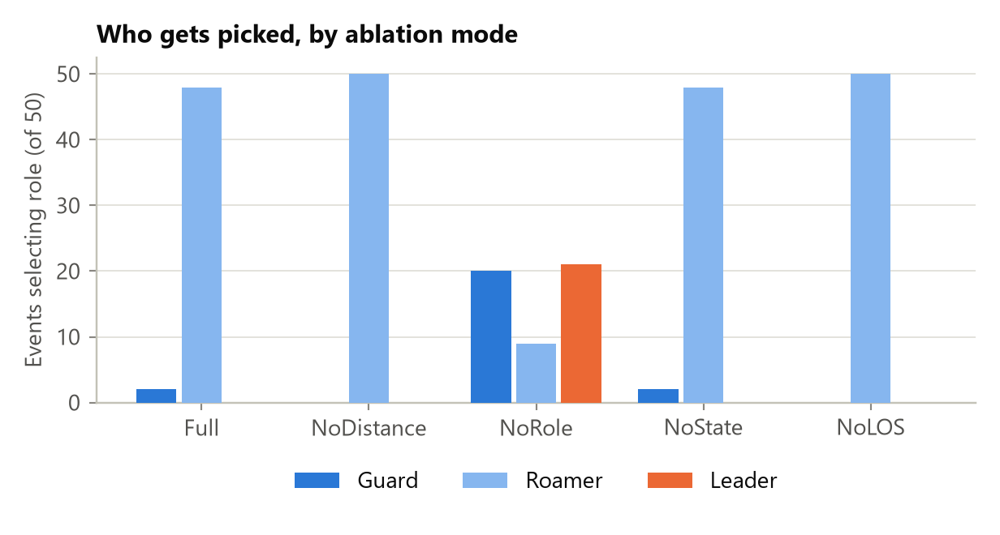
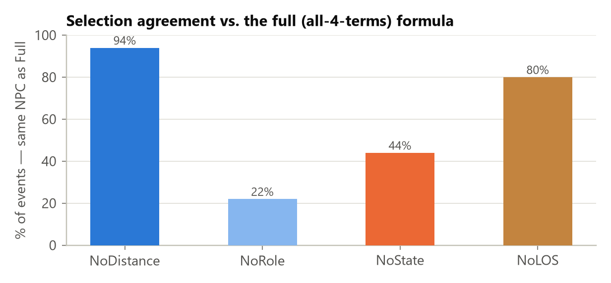
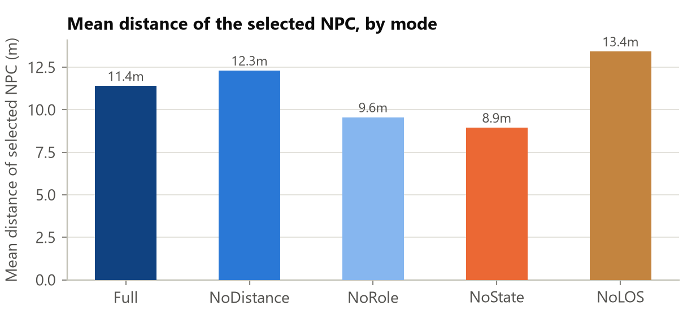
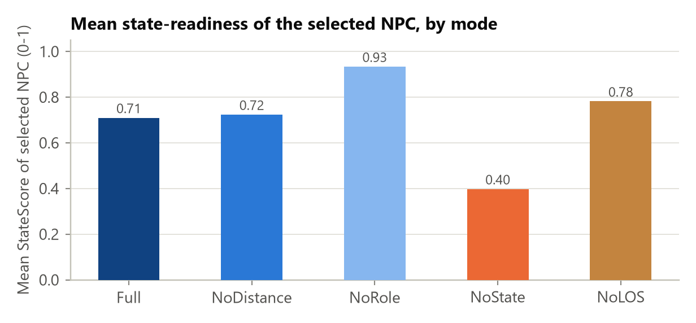
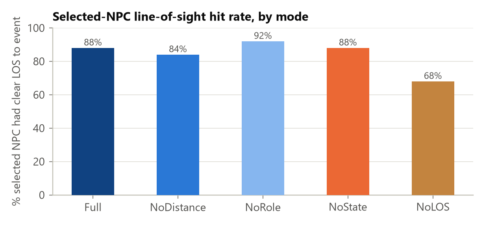
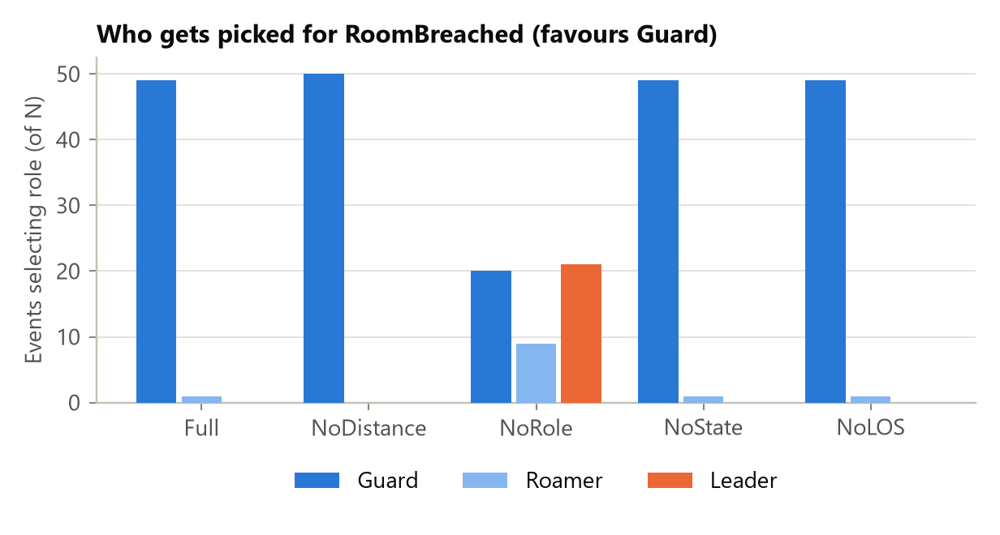
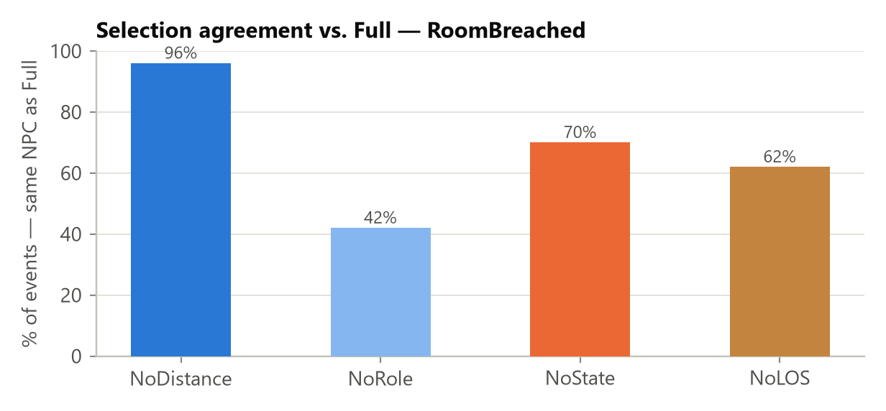
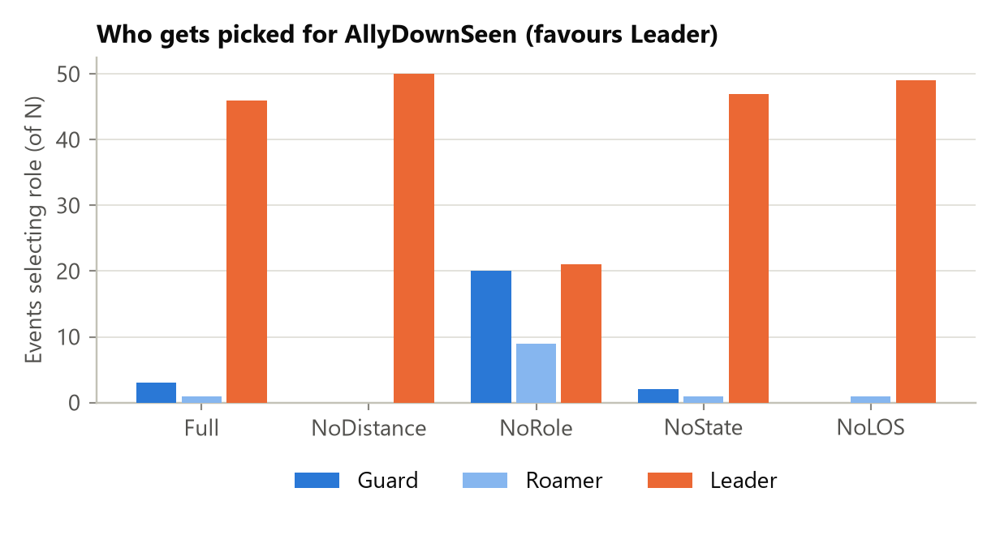
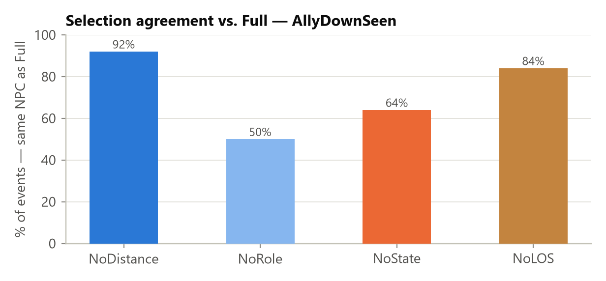
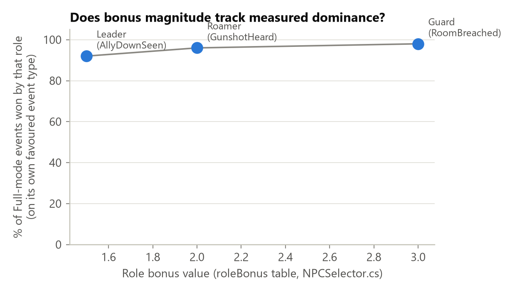

# Module 2 — NPC Selection Ablation Study: Full Results

**What this measures.** `EventManager` routes every "targeted" scenario event (i.e.
not a broadcast type) to exactly one NPC, chosen by `NPCSelector.SelectBest`
([NPCSelector.cs](Assets/Scripts/Selection/NPCSelector.cs)). The score is a weighted
sum of four factors:

```
score = (1/distance) × DistanceWeight
      + roleBonus[role][eventType] × RoleWeight
      + stateReadiness              × StateWeight
      + losBonus                    × LosWeight
```

This study measures how much each of those four terms actually matters by running
the real selector with one term zeroed out at a time ("ablated") and comparing the
result to the full formula, on identical events.

> **What "matters" means here — and what it doesn't.** Every comparison in this
> study is the formula against *itself* (full formula vs. the same formula with
> one term removed) — there is no external ground truth involved anywhere. So
> when a result says "removing Role changes 78% of decisions," that is a real,
> **not** circular finding: it did not have to come out that way — it could just
> as easily have been 2% if the other three terms already agreed with Role most
> of the time, and it wasn't assumed by the test. What this proves is that the
> formula's output **genuinely depends on** that input — the term isn't dead
> weight. What it does **NOT** prove is that including the term makes the
> decision *better*, more *realistic*, or *doctrinally correct* — proving that
> would require comparing selections against an external judgement (e.g. a
> subject-matter expert's opinion of who *should* respond), which this study
> does not do. Read every finding below as "this term has real, measurable
> influence on the outcome," never as "this term produces the correct outcome."

**Status.** This is a **real run**, not a simulation. It executed live inside the
Unity Editor (6000.3.1f1) via MCP on **2026-08-01**, using the project's own
`AblationExperimentRunner` and `NPCSelector` compiled code — the same code path the
shipping game uses.

---

## 1. What changed in the test harness before running it

The existing `AblationExperimentRunner` ([source](Assets/Scripts/Tests/AblationExperimentRunner.cs))
only tested **3 of the 4** scoring terms — it had `Full`, `NoLOS`, `NoDistance`,
`NoRole` modes, but never disabled `StateWeight`, even though state-readiness is one
of the four documented factors in `NPCSelector`. It also spawned every synthetic
terrorist with the same default `currentState = Idle`, so `StateScore` was a
constant `1.0` for every candidate — with no variance across candidates, ablating
the state term could never change a ranking, making a `NoState` mode pointless even
if it existed.

Two small, targeted fixes were made to close this gap (both diffs are in the repo):

1. Added a fifth ablation mode, **`NoState`** (`StateWeight = 0`), alongside `Full`,
   `NoDistance`, `NoRole`, `NoLOS`.
2. Spawned NPCs now round-robin through `Idle / Suspicious / Alert / TakeCover /
   Retreat` instead of all defaulting to `Idle`, so the state term has real
   variance to be measured against.
3. Added a `state_score` column to the CSV export so the selected NPC's
   state-readiness is recorded per decision, not just its distance/LOS.

No change was made to `NPCSelector` itself — only to the *test harness* that
exercises it, so the scoring logic under test is unmodified production code.

## 2. Method

| Parameter | Value |
|---|---|
| NPCs | 8 terrorists, round-robin roles (Guard/Roamer/Leader) and round-robin states (Idle/Suspicious/Alert/TakeCover/Retreat) |
| Events | 50 random `GunshotHeard` events, uniform in a 30m × 30m arena |
| Occlusion | One centre wall (10m × 3m × 1m) placed at the origin, so ~10-30% of shots have their nearest responder LOS-blocked |
| Seed | 42 (reproducible NPC placement + event positions) |
| Modes per event | `Full`, `NoDistance`, `NoRole`, `NoState`, `NoLOS` — same 50 events replayed under each mode |
| Total decisions | 50 events × 5 modes = **250 selection calls** |
| Engine | Unity 6000.3.1f1, run live via MCP in the project's own `XRI Starter Kit` scene |
| Weights (Full) | DistanceWeight = 2.0, RoleWeight = 1.0, StateWeight = 1.0, LosWeight = 1.0 (all project defaults, unchanged) |

Raw output: [Report_Figures/ablation_data/AblationResults_20260801_120355.csv](Report_Figures/ablation_data/AblationResults_20260801_120355.csv)
(all 250 rows — event position, ablation mode, selected NPC, its role, its
distance to the shot, whether it had line-of-sight, and its state-readiness score).

## 3. Headline numbers

| Mode | Guard picks | Roamer picks | Leader picks | Mean dist. of pick | Mean StateScore of pick | LOS hit-rate | Agreement with Full |
|---|--:|--:|--:|--:|--:|--:|--:|
| **Full**       | 2  | 48 | 0  | 11.40 m | 0.71 | 88% | 100% (baseline) |
| **NoDistance** | 0  | 50 | 0  | 12.30 m | 0.72 | 84% | **94%** |
| **NoRole**     | 20 | 9  | 21 | 9.56 m  | 0.93 | 92% | **22%** |
| **NoState**    | 2  | 48 | 0  | 8.95 m  | 0.40 | 88% | **44%** |
| **NoLOS**      | 0  | 50 | 0  | 13.43 m | 0.78 | 68% | **80%** |

"Agreement with Full" = the % of the 50 events where the ablated mode picked the
*exact same NPC* as the full formula. Lower agreement = that term changes who
responds more often = that term matters more.

### Fig 1 — who gets picked, by mode


Under `Full`, `NoDistance`, `NoState`, and `NoLOS`, **Roamers win almost every
event** (48-50 / 50) — because `Roamer + GunshotHeard = +2.0` is the single
largest additive term in the formula, roughly matching or beating the maximum
plausible distance contribution (`2.0 × 1/dist`, which only rivals 2.0 when the
NPC is within ~1m). Only when the role bonus itself is removed (`NoRole`) does the
picture change completely: Guards and Leaders — who get **zero** role bonus for
`GunshotHeard` — suddenly win 41/50 events between them, because without their
competitor's flat +2.0 head start, proximity and state-readiness decide instead.

### Fig 2 — selection agreement vs. the full formula


This is the clearest ranking of "how much does each term matter, in THIS arena
and event distribution":

1. **Role (22% agreement → 78% of decisions flip)** — by far the dominant term.
   Removing it changes the winner in more than 3 out of 4 events.
2. **State (44% agreement → 56% flip)** — a strong secondary factor. More than
   half the time, the NPC that's most "ready" to respond isn't the one distance
   or role alone would have picked.
3. **LOS (80% agreement → 20% flip)** — a real but smaller effect: one in five
   decisions changes when perception is ignored.
4. **Distance (94% agreement → 6% flip)** — the smallest effect of the four in
   this configuration. Distance still shapes *scores*, but rarely flips the
   *winner*, because the role bonus usually already dominates the ranking before
   distance is even added.

### Fig 3 — mean distance of the selected NPC


Isolating the one comparison this metric is actually valid for — **Full (11.40m)
vs. NoDistance (12.30m)** — removing the distance term sends a responder that is,
on average, **0.9m farther away** from the gunshot. That is a real but modest
effect for this arena size (30m × 30m), consistent with distance being a
tie-breaker rather than the deciding factor here. (The lower distances under
`NoRole` and `NoState` are a side-effect of *those* terms changing who wins, not
evidence about the distance term itself — cross-mode bars other than the
Full/NoDistance pair aren't isolating the same variable.)

### Fig 4 — mean state-readiness of the selected NPC


The valid pair here is **Full (0.71) vs. NoState (0.40)**: removing the
state-readiness term nearly halves the average readiness of who gets sent — the
formula is genuinely pulling toward more "available" (Idle/Suspicious) NPCs over
busier (TakeCover/Retreat) ones when the term is active, and loses that entirely
without it.

### Fig 5 — line-of-sight hit rate of the selected NPC


The valid pair is **Full (88%) vs. NoLOS (68%)**: without the perception term, the
selector sends an NPC that can't actually see the event origin 32% of the time,
up from 12% — almost a 3x increase in "blind" dispatches. This is the term that
most directly protects against picking a responder who is technically close but
behind a wall.

## 4. Interpretation for the report / slide

- The formula's four terms are **not equally load-bearing** in this test
  configuration. Ranked by how often each one changes the outcome: **Role ≫ State
  > LOS > Distance**. (Again: this ranks how much each term *influences* the
  output, not how *correct* the output is with vs. without it.)
- This does **not** mean distance or LOS are poorly designed — it means that, given
  the current role-bonus magnitudes (Guard/Roamer/Leader bonuses of 3.0/2.0/1.5)
  relative to a 30m arena, role dominates the ranking before the other terms get a
  chance to matter as often. If the design intent is for distance to matter more
  relative to role, the fix is tuning `RoleWeight` down or `DistanceWeight` up
  relative to each other — not evidence of a bug.
- The **NoRole** result is worth a specific callout for the report: 78% of
  decisions change when role is removed, and the responder pool flips from
  "almost always the Roamer" to "roughly even across all three roles." That's a
  strong, concrete number for the "context-aware multi-factor scoring" claim.
- The **State** result was previously untestable in this harness (see §1) — this
  run is the first time it's been measured, and it shows a real, substantial
  effect (56% flip rate), not a token term.

## 5. Caveats / what this does NOT show

- **One arena, one seed, one event type.** All 250 decisions are `GunshotHeard`
  events in a single 30m × 30m arena with one occluding wall. The *relative*
  ranking of terms (role > state > LOS > distance) is specific to this arena
  scale and role-bonus table — a much larger arena would likely shift distance's
  relative importance upward, and a different event type (e.g. `RoomBreached`,
  which favors `Guard`) would shift the role-bonus story entirely.
- **n = 50 events per mode.** Adequate for the observed effect sizes here (a
  56-78% flip rate is far outside noise), but not a large-sample statistical
  study — no confidence intervals or significance tests are computed.
- **Synthetic NPCs, not live gameplay.** NPCs are spawned standing still
  (`idleMode = Static`) purely to be scored; this isolates the selector's
  decision logic but doesn't reflect a full mission with moving squads, active
  engagements, or the cooldown/`CanRespond` filtering that runs before real
  candidates ever reach `NPCSelector` in-game.
- **Distance/LOS conclusions are pairwise, not global.** As noted under Figs 3-5,
  only the Full-vs-single-ablation comparison isolates one variable; comparing
  e.g. `NoRole`'s distance to `NoState`'s distance conflates two different
  changes and isn't a valid claim about either term in isolation.
- **"Changes the outcome" measures influence, not correctness.** Every number in
  this report comes from comparing the formula against itself (with vs. without
  a term) — never against an external judgement of which NPC *should* have
  responded. A high flip-rate (like Role's 78%) proves that term is doing real
  work in the formula; it does not prove that work makes the AI's decisions more
  realistic or doctrinally sound. That would need the SME comparison described
  in `MODULE2_EVALUATION_METHODOLOGY.md` (Part B5), which this study doesn't
  attempt.

## 6. Reproducing this run

1. Open the project in Unity 6000.3.1f1+ with MCP for Unity connected, enter Play
   mode in any scene.
2. Add an empty GameObject, attach `AblationExperimentRunner`, set
   `npcCount = 8`, `eventCount = 50`, `seed = 42`, `addCentreWall = true`.
3. Invoke its context menu action `EXP → Run Ablation Experiment` (or call the
   private `RunMenu()` via reflection, as this run did).
4. The CSV is written to
   `Application.persistentDataPath/Telemetry/AblationResults_<timestamp>.csv`.
5. Regenerate the charts/summary in this report with:
   ```
   cd Report_Figures
   python generate_ablation_charts.py
   ```
   (edit the `DATA` path at the top of the script to point at a new CSV if you
   re-run the experiment).

---

## 7. Extending to RoomBreached and AllyDownSeen (2026-08-09)

**The gap.** Everything above (§1-6) only ever tested `GunshotHeard` events.
Look at the role-bonus table in `NPCSelector.GetRoleBonus`:

```
(Guard,  RoomBreached) → 3.0
(Roamer, GunshotHeard) → 2.0
(Leader, AllyDownSeen) → 1.5
```

A `GunshotHeard`-only study can **only ever** exercise the Roamer bonus — every
Guard and Leader candidate scores exactly `0.0` role bonus on every single test
event, because their bonus is defined for a *different* event type that never
appeared in the data. §5 of this report already names this limitation
("a different event type... would shift the role-bonus story entirely") but it
was not tested until now. This section closes that gap.

### 7.1 Method

Identical NPC setup to §2 (8 terrorists, round-robin Guard/Roamer/Leader roles
and Idle/Suspicious/Alert/TakeCover/Retreat states, seed=42, one occluding
centre wall), but `AblationExperimentRunner` was extended
([diff in source](Assets/Scripts/Tests/AblationExperimentRunner.cs)) to test
**three** event types — `GunshotHeard`, `RoomBreached`, `AllyDownSeen` —
against the **same 50 event positions**, reused identically across all three.
This matters: any difference found between event types can only be caused by
which role's bonus applies, never by the three types having been tested
against different points in space.

| Parameter | Value |
|---|---|
| NPCs | 8 terrorists, round-robin roles (3 Guard, 3 Roamer, 2 Leader) and round-robin states |
| Event positions | 50, shared identically across all 3 event types |
| Event types | GunshotHeard (favours Roamer), RoomBreached (favours Guard), AllyDownSeen (favours Leader) |
| Modes per event | Full, NoDistance, NoRole, NoState, NoLOS |
| Total decisions | 50 events × 3 event types × 5 modes = **750 selection calls** |
| Seed | 42 (identical NPC layout and event positions to the §1-6 study) |

**Status.** Real run, executed live inside the Unity Editor (6000.3.1f1) via
MCP on **2026-08-09**, using the project's own updated
`AblationExperimentRunner` and unmodified `NPCSelector` production code.

Raw output: [Report_Figures/ablation_data/AblationResults_MULTIEVENT_20260809_150537.csv](Report_Figures/ablation_data/AblationResults_MULTIEVENT_20260809_150537.csv)
(750 rows — event type, event position, ablation mode, selected NPC, its role,
distance, LOS, state-readiness).

**Reproducibility check.** The `GunshotHeard` rows in this run are
**bit-for-bit identical** to the original §1-6 study (same Full/NoDistance/
NoRole/NoState/NoLOS role counts and agreement percentages, down to the exact
NPC IDs picked) — an independent confirmation, eight days later and a
different Unity session, that the seed=42 setup really is deterministic and
reproducible, not just claimed to be.

### 7.2 Headline numbers

| Event type | Favoured role | Bonus | Full: Guard/Roamer/Leader | Full-mode dominance of favoured role |
|---|---|--:|---|--:|
| GunshotHeard | Roamer | 2.0 | 2 / **48** / 0 | 96% |
| RoomBreached | Guard | 3.0 | **49** / 1 / 0 | **98%** |
| AllyDownSeen | Leader | 1.5 | 3 / 1 / **46** | 92% |

Full agreement/ablation breakdown, all three event types:

| Event type | Mode | Guard | Roamer | Leader | Agreement w/ Full |
|---|---|--:|--:|--:|--:|
| GunshotHeard | Full | 2 | 48 | 0 | 100% (baseline) |
| GunshotHeard | NoDistance | 0 | 50 | 0 | 94% |
| GunshotHeard | NoRole | 20 | 9 | 21 | 22% |
| GunshotHeard | NoState | 2 | 48 | 0 | 44% |
| GunshotHeard | NoLOS | 0 | 50 | 0 | 80% |
| RoomBreached | Full | 49 | 1 | 0 | 100% (baseline) |
| RoomBreached | NoDistance | 50 | 0 | 0 | 96% |
| RoomBreached | NoRole | 20 | 9 | 21 | 42% |
| RoomBreached | NoState | 49 | 1 | 0 | 70% |
| RoomBreached | NoLOS | 49 | 1 | 0 | 62% |
| AllyDownSeen | Full | 3 | 1 | 46 | 100% (baseline) |
| AllyDownSeen | NoDistance | 0 | 0 | 50 | 92% |
| AllyDownSeen | NoRole | 20 | 9 | 21 | 50% |
| AllyDownSeen | NoState | 2 | 1 | 47 | 64% |
| AllyDownSeen | NoLOS | 0 | 1 | 49 | 84% |

### Fig 6/7 — role distribution and agreement, RoomBreached

*Who gets picked for RoomBreached (favours Guard).*

*Selection agreement vs. Full — RoomBreached.*

### Fig 8/9 — role distribution and agreement, AllyDownSeen

*Who gets picked for AllyDownSeen (favours Leader).*

*Selection agreement vs. Full — AllyDownSeen.*

### Fig 10 — does bonus magnitude track measured dominance?

*For each event type, the % of Full-mode events won by that event's favoured
role, plotted against that role's bonus value.*

### 7.3 Interpretation

- **Every role dominates its own favoured event type** — not just Roamer's.
  Guard wins 98% of RoomBreached events, Roamer 96% of GunshotHeard events,
  Leader 92% of AllyDownSeen events. The formula behaves as designed for all
  three role-bonus entries, not only the one that happened to be tested before.
- **The relative ordering of the three bonus magnitudes tracks the relative
  ordering of measured dominance**: Guard (3.0) > Roamer (2.0) > Leader (1.5)
  in bonus value, and 98% > 96% > 92% in measured dominance — monotonic, in
  the intended direction. This is real, useful evidence for the *relative*
  design of the role-bonus table (bigger bonus → proportionally stronger
  preference) even though — as stated plainly in
  `MODULE2_SELECTION_LITERATURE_JUSTIFICATION.md` — no literature source fixes
  the *absolute* values 3.0/2.0/1.5 themselves. This experiment does not
  manufacture a citation for those numbers; it demonstrates the formula's
  *behaviour* is internally consistent with its own design intent, which is a
  different and more limited claim.
- **`NoRole` produces the identical 20/9/21 role split for all three event
  types.** This is not a coincidence and not a new finding about role
  specifically — it is the expected consequence of reusing the same 50 event
  positions and the same 8 NPCs across all three event types: once the role
  term is zeroed, distance/state/LOS are the only remaining terms, and none of
  them read the event type, so the outcome is necessarily identical. It is
  included here as confirmation the shared-position experimental design
  actually worked as intended, not as a substantive result.
- **The magnitude of the bonus visibly changes how much removing it
  matters** — RoomBreached (bonus 3.0) drops to 42% agreement when Role is
  removed; AllyDownSeen (bonus 1.5, the smallest) only drops to 50%. A bigger
  bonus is more consequential to remove, which is the expected direction, but
  reading too much into the exact agreement percentages here would repeat the
  §5 caveat: distance/state/LOS still shape *which specific* NPC of the
  favoured role wins, and the three role populations differ in size (3 Guards,
  3 Roamers, 2 Leaders), which is a second variable this comparison doesn't
  isolate.

### 7.4 Caveats (in addition to §5, which still apply in full)

- **Still one arena, one seed.** All 750 decisions share the same 30m × 30m
  arena and the same 8-NPC layout as the original study — this section adds a
  second independent variable (event type) but does not add arena-scale or
  NPC-count variation.
- **"Dominance" and "agreement" still measure formula self-consistency, not
  correctness.** The same caveat as §5 applies without modification: showing
  Guard wins 98% of RoomBreached events under the current formula proves the
  Guard bonus is doing real, substantial work — it does not independently
  establish that a Guard *should* be the one who responds to a room breach.
  That would need the SME comparison in `MODULE2_EVALUATION_METHODOLOGY.md`
  (Part B5).
- **The bonus-vs-dominance chart (Fig 10) has three data points.** Three
  points showing a monotonic trend is suggestive and honestly reportable, but
  it is not a statistically powered claim — a fourth or fifth role-bonus value
  would strengthen it considerably. Report it as "consistent with the intended
  design," not as a proof of correct calibration.

### 7.5 Reproducing this extension

Same procedure as §6, using the now-updated `AblationExperimentRunner` (tests
all three event types automatically — no extra configuration needed) and:
```
cd Report_Figures
python generate_ablation_charts_by_eventtype.py
```
(edit the `DATA` path at the top of that script to point at a new CSV if you
re-run the experiment; it will refuse to run against a CSV that lacks the
`event_type` column, i.e. one produced by the pre-2026-08-09 version of the
runner).
