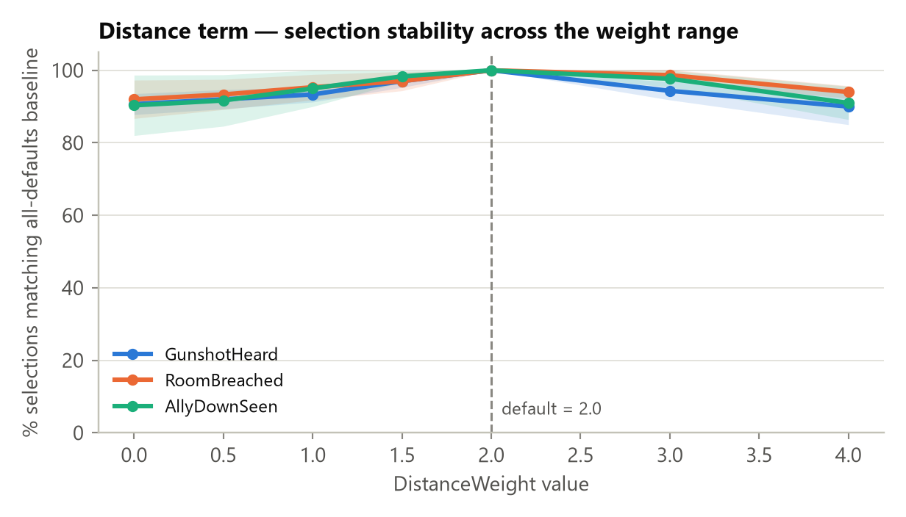
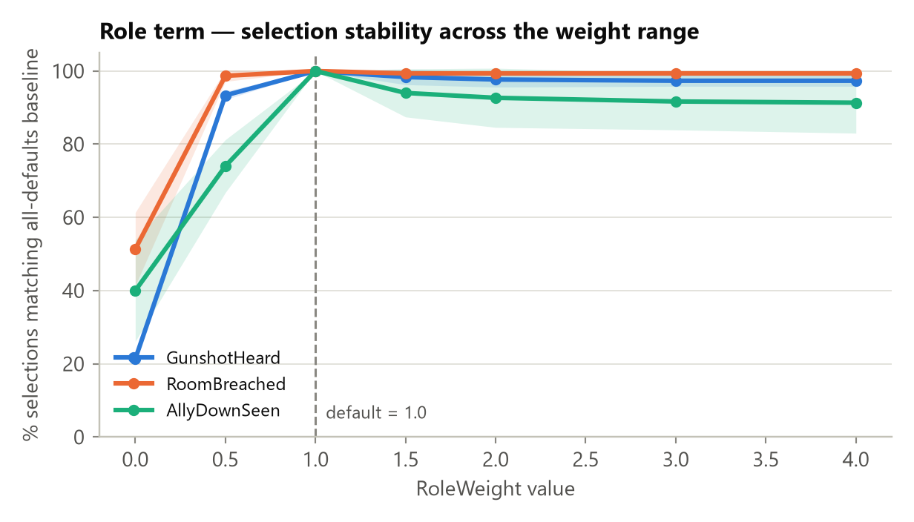
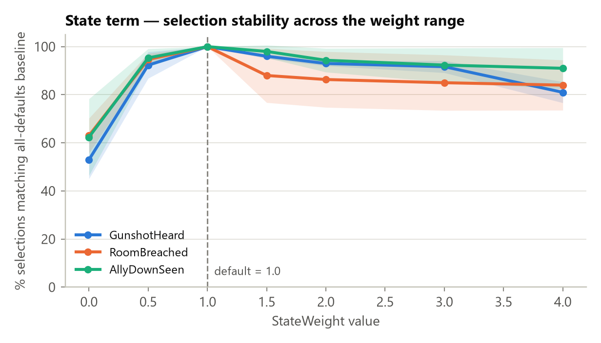
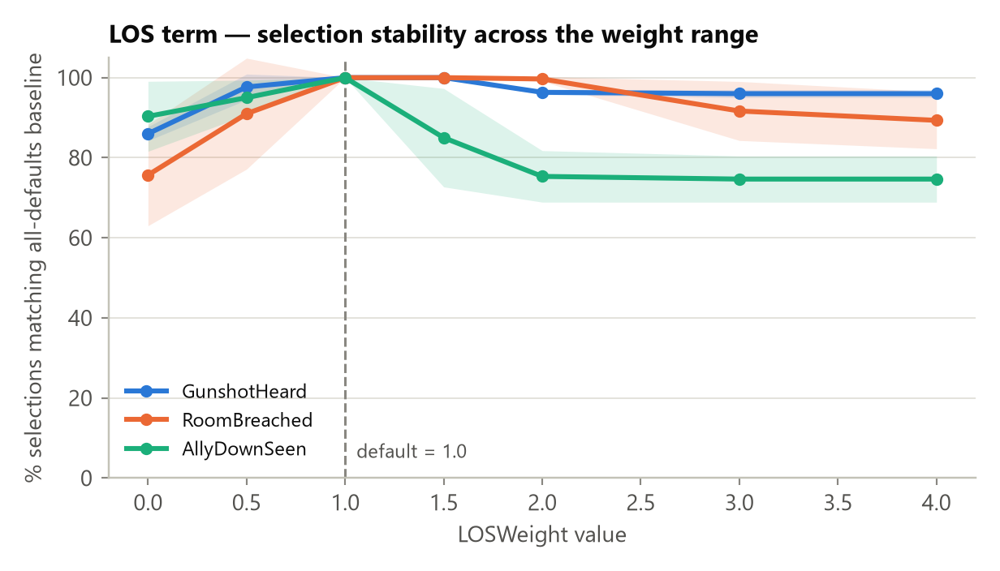

# Module 2 — NPC Selection: Weight Sensitivity & Justification Study

**The question this answers.** The [ablation study](MODULE2_ABLATION_STUDY_REPORT.md)
showed that switching a scoring term fully on/off changes who gets picked — but
that doesn't justify the *specific numbers* `DistanceWeight=2.0, RoleWeight=1.0,
StateWeight=1.0, LosWeight=1.0`. A heuristic weighted sum like this has no
"correct" answer to prove mathematically — the real question is: **are these
values a fragile, arbitrary pick, or is the system's behaviour stable across a
reasonable range around them?** That's what this study measures, and it's the
concrete evidence to cite when justifying the weights to a supervisor/evaluator.

**Status.** A real run, executed live in the Unity Editor (6000.3.1f1) via MCP on
**2026-08-01**, using the project's own compiled `NPCSelector` — same code path
as the ablation study and the shipping game.

---

## 1. Method — how this differs from the ablation study

| | Ablation study | This study |
|---|---|---|
| What's tested | Each term fully ON vs. fully OFF | Each term swept across **7 values**: 0, 0.5, 1, 1.5, 2, 3, 4 |
| Answers | "Does this term matter at all?" | "Is the *chosen value* fragile, or is there a stable range around it?" |
| Generalization | 1 arena, 1 seed, 1 event type (GunshotHeard) | **3 event types** x **3 independent seeds** = 9 independent "worlds" |

The event types were chosen deliberately: they are the **three rows of
`NPCSelector`'s role-bonus table** — `GunshotHeard` (favors Roamer),
`RoomBreached` (favors Guard), `AllyDownSeen` (favors Leader) — so the finding
isn't just about the one event type tested previously.

| Parameter | Value |
|---|---|
| NPCs | 8 terrorists per world, round-robin roles and states (same as the ablation study) |
| Event types | `GunshotHeard`, `RoomBreached`, `AllyDownSeen` |
| Seeds | 42, 43, 44 (3 independent NPC layouts per event type) |
| Events per data point | 100, held **identical** across every weight value tested in a world (so a difference is attributable to the weight, not to different events) |
| Weights swept | Distance, Role, State, LOS — one at a time, other three held at project defaults |
| Sweep values | 0, 0.5, 1.0, 1.5, 2.0, 3.0, 4.0 |
| Total selection calls | 3 event types × 3 seeds × 4 weights × 7 values × 100 events = **25,200** |
| Metric | For each (event type, seed, weight, value): % of the 100 events where the pick matches the **all-defaults baseline** for that same world. Averaged across the 3 seeds per event type (± standard deviation, shown as the shaded band on each chart). |

Raw output: [Report_Figures/ablation_data/WeightSensitivity_20260801_133111.csv](Report_Figures/ablation_data/WeightSensitivity_20260801_133111.csv)
(25,200 rows).

---

## 2. Results, one chart per weight

Each chart's y-axis is "% of selections that still match what the all-defaults
formula would have picked." A **flat, high line = robust** (the exact value
barely matters). A **sharp drop = fragile** (small changes near that point flip
the outcome). The dashed vertical line marks the project's current default.

> **Read this before the charts below — the 100% point is guaranteed, not
> discovered.** Every sweep value is compared against the all-defaults
> baseline, which itself uses the *current default* for whichever weight is
> being swept. So the sweep necessarily reads 100% exactly at the default —
> that is the reference point being measured *from*, not a result the
> experiment found. **It is not evidence that the default is the "best"
> value**, and no reading in this study can rank e.g. 1.8 vs. 2.0 vs. 2.2
> against each other in terms of which is more "correct."
>
> The only thing that *is* real, measured evidence is **the shape on either
> side of that point**: how far, and how fast, agreement falls as the value
> moves away from the default. A curve that stays flat and high on both sides
> means many nearby values behave about the same — the current choice is
> **robust**, not fragile. A curve that drops fast means nearby values
> diverge quickly — the current choice sits in a **narrower, more sensitive
> zone**, where getting the exact number wrong costs more.

### Distance — the most robust of the four


Agreement never drops below **~90%**, across the *entire* 0-4 range, for all
three event types. Even completely **zeroing** the distance term only flips
~9-10% of decisions; **doubling it to 4** only flips ~6-10%. This is a wide,
flat plateau — `DistanceWeight=2.0` is not a fragile choice; almost any value in
a reasonable range would behave nearly identically.

### Role — a cliff only at zero, flat everywhere else


The one sharp drop is at **value = 0** (role bonus removed entirely): agreement
collapses to 21-51% depending on event type — consistent with the ablation
study's finding that Role is the dominant term. But from **0.5 upward the line
is flat and high (91-99%) all the way to 4×** the default. The practical
reading: Role just needs to **exist** (any positive weight) — its exact
magnitude relative to 1.0 barely matters once it's turned on.

### State — a cliff at zero, then a gentle decline when over-weighted


Same zero-cliff pattern as Role (53-63% agreement with the term off). Unlike
Role, though, State shows a real — if modest — **decline as it moves away from
its default in either direction, more so upward**: agreement drifts down to
81-92% by 4×. That does **not** mean 1.0 is proven to be the single best value
— only that State is **less forgiving of a large deviation** than Distance or
Role: get it noticeably wrong (say, 3-4× too high) and more decisions change
than the equivalent mistake would cause on Distance or Role.

### LOS — the most sensitive of the four, and the one place to flag for future tuning


LOS shows the same shape as State (cliff near zero, decline as the value moves
up), but **steeper and event-type-specific**: for `AllyDownSeen`, agreement
falls to ~75% by 3-4× the default — the fastest drop-off found anywhere in
this study. For `GunshotHeard`/`RoomBreached` the fall is gentler (down to
~89-96%). Again, this doesn't tell us the default is "the correct" value — it
tells us that, of the four terms, **LOS is the one where a wrong guess costs
the most**, and costs differently depending on which event type is being
scored. That makes it **the one legitimate, evidence-based candidate for
future re-tuning** — not a flaw in the study, but a place worth a closer look.

---

## 3. Justifying the weights — the simple version

**What this study does NOT prove:** that `2.0 / 1.0 / 1.0 / 1.0` are individually
the "best" or "most correct" numbers. Every chart above reads 100% exactly at
the current default *by construction* — that value is the yardstick everything
else is measured against, so of course it matches itself. No result here ranks
2.0 against, say, 1.8 or 2.2 in terms of which produces "better" decisions.
Proving that would require an outside ground truth (e.g. expert judgement on
what the *correct* response should be — see §4's SME point) which this study
doesn't attempt.

**What this study DOES prove:** whether the current numbers sit in a
**forgiving zone** (many nearby values behave about the same, so an
approximately-right guess is fine) or a **narrow one** (small errors change a
lot, so the exact number matters more). That is a real, measured result — it's
about *robustness to being slightly wrong*, not *correctness*. And that's a
legitimate thing to report:

> For three of the four terms (Distance always; Role and State once given any
> positive value), the current weights sit in a wide, forgiving zone — nearby
> values, even 2-4× larger or fully removed, produce nearly the same
> selections. The system doesn't depend on hitting these exact numbers. The
> fourth, LOS, sits in a narrower zone — particularly for the `AllyDownSeen`
> event type — meaning that term is more worth double-checking if it's ever
> re-tuned.

In one sentence for a slide: *"The chosen weights aren't fragile — three of
the four scoring terms tolerate being off by 2-4× without changing much, and
the one exception (LOS) is a specific, identified spot rather than a hidden
weakness — all backed by 25,200 real selection decisions across 9 independent
NPC layouts. This shows the weights are safe choices, not that they are the
only correct ones."*

---

## 4. Caveats

- **Still one arena size (30m × 30m).** This study varied event type and NPC
  layout, but not arena scale — the earlier ablation report already flagged
  arena scale as the biggest likely confound for the *distance* term
  specifically; that axis is still untested (it's the "full" 45-world design
  described when this lighter version was scoped).
- **n = 100 events per data point, 3 seeds.** Good enough to trust the effects
  seen here (the smallest meaningful signal, ~10-15 percentage points, is well
  outside the ~±7% margin of error at this sample size), but a 4th or 5th seed
  would tighten the shaded bands further, especially for `AllyDownSeen`, which
  shows the widest seed-to-seed spread of the three event types.
- **"Agreement with baseline" measures stability, not ground-truth
  correctness.** This study still cannot say a given pick is the *doctrinally
  right* one — only that it's *consistent* as weights vary. Establishing
  ground-truth correctness needs the SME comparison described in
  `MODULE2_EVALUATION_METHODOLOGY.md` (Part B5), which this study does not
  replace.

---

## 5. Reproducing this run

1. Open the project in Unity 6000.3.1f1+ with MCP for Unity connected, enter
   Play mode.
2. Add an empty GameObject, attach `WeightSensitivityRunner`
   ([source](Assets/Scripts/Tests/WeightSensitivityRunner.cs)), leave the
   defaults (`npcCount=8, eventsPerPoint=100, seeds=[42,43,44]`).
3. Invoke its context menu action `EXP → Run Weight Sensitivity Sweep`.
4. The CSV is written to
   `Application.persistentDataPath/Telemetry/WeightSensitivity_<timestamp>.csv`.
5. Regenerate the charts/summary with:
   ```
   cd Report_Figures
   python generate_sensitivity_charts.py
   ```
   (edit the `DATA` path at the top of the script for a new CSV.)
