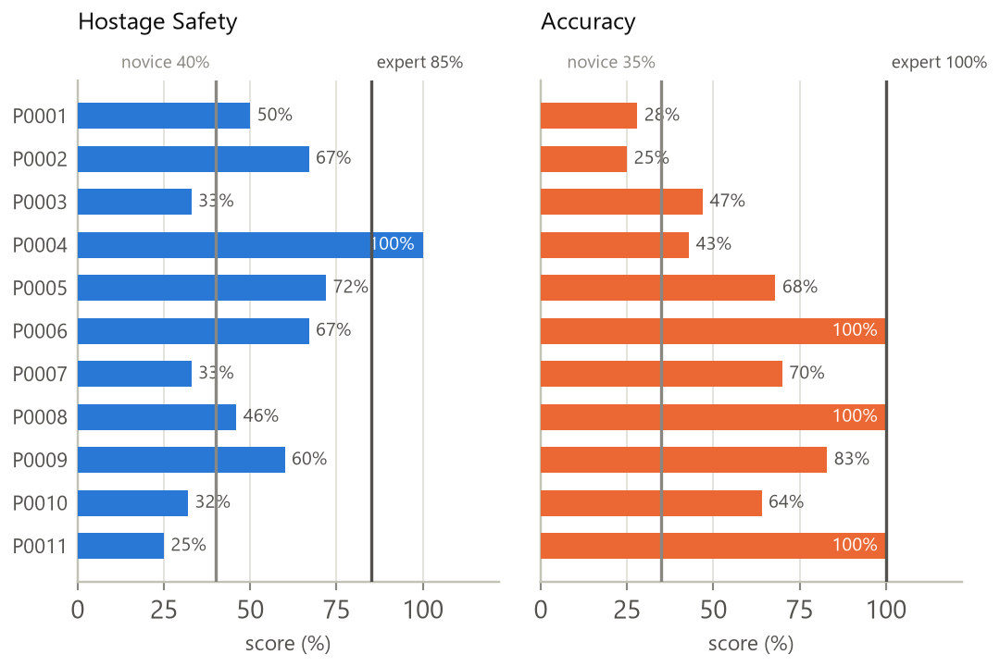
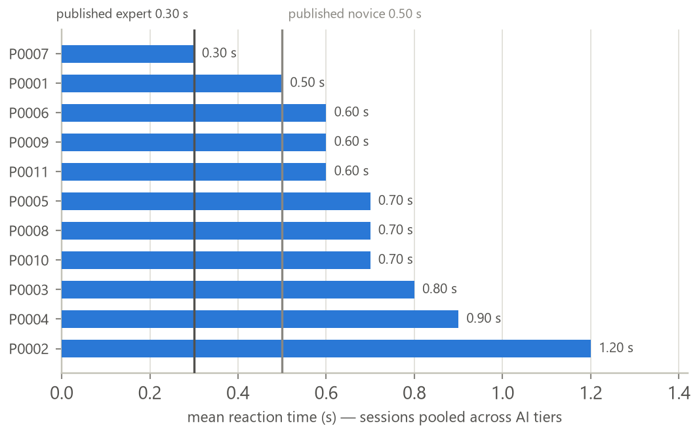

# Module 4 — Evaluation Against the Expert Value Table

**Sentinels VR Hostage-Rescue Trainer · University of Moratuwa · 2026**
**Purpose:** use the *Expert Value Table* (`Expert Value Table.pdf`) — a curated set of research-derived benchmark values — to evaluate whether Module 4's scoring is **valid** (agrees with the real-world/research numbers), and to list the calibrations that would improve it.

**How to read this:** each row states (a) what Module 4 actually does in code, (b) what the expert table says the value/shape should be, and (c) a verdict — ✅ validated, ⚠️ needs calibration, or ❌ not captured.

> Note on the table's status: it is a **synthesis** of real, citable sources (NYPD SOP-9, Fitts's Law, Hick's Law, Yerkes–Dodson, Polyvagal/SUDS, RAND hostage-rescue data, friendly-fire and negligent-discharge studies). Some pieces are hard research values (hit rates, reaction times, rescue survival rates); a few are the project's own calibrations that the table judges *consistent* with research (e.g. the distress percentages, the friendly-fire curve shape). This evaluation treats it as a benchmark reference, not a single peer-reviewed instrument.

---

## 1. Hostage distress model — ✅ STRONGLY VALIDATED

- **Module 4 (code):** `HostageStateEntry.ComputeDistress` → Calm `0.00`, Follow `0.10`, Fearful `0.33`, Freeze `0.50`, Panic `0.66`.
- **Expert table (Piece B):** maps these five states onto clinically-recognised trauma stages (Calm = ventral vagal, Follow = fawn, Fearful = sympathetic fight/flight, Freeze = dorsal-vagal shutdown, Panic = extreme dysregulation), confirms the **escalation order** *Calm → Follow → Fearful → Freeze → Panic* matches the research, and states the `0/10/33/50/66` values are *"a reasonable compressed version"* of the clinical **SUDS** 0–100 distress scale.
- **Verdict:** ✅ **The *ordering* is Module 4's most strongly validated design element.** The escalation sequence, and specifically the two counter-intuitive rankings (Freeze above Panic; Threatened above Panic), are each traceable to a cited finding.
- ⚠️ **The exact percentages are NOT research values — do not present them as such.** This is the single easiest overclaim to make here, so it is stated explicitly:
  - **SUDS is a *self-report* instrument** — a person rates *their own* distress 0–100. No published table maps a categorical state onto a number, so there is no source that says "Freeze = 72 %". Assigning numbers to polyvagal categories is *interpretation*.
  - The Expert Value Table called `0/10/33/50/66` *"a reasonable compressed version"* of SUDS. That is an endorsement of **plausibility**, not a derivation — it means "these numbers are not unreasonable", not "these numbers are the published values".
  - `Held 40`, `Threatened 75`, `Wounded 95`, `Down 100`, and the revised `Freeze 72` are **entirely the project's own calibration**. The tonic-immobility research supports Freeze ranking *above* Panic; the value 72 was chosen to sit just above Panic's 66, and is not measured.
- **The defensible claim, in one sentence:** *the distress model's **ordering** is research-derived and the **scale type** is modelled on the validated SUDS instrument; the **specific values** are the project's calibration, judged consistent with — not derived from — the source research.* Same standing as the Speed coefficients (§8) and the `threatDiscrimination` levels in `HOSTAGE_PROFILE_RESEARCH.md`.

## 2. Hostage rescue outcome — ✅ VALIDATED

- **Module 4 (code):** hostage safety uses `hostagesSaved / hostagesTotal` (a binary per-hostage outcome).
- **Expert table (Piece A, RAND):** negotiated resolution ~85–90% survive, **tactical rescue assault ~70–75% survive**, no intervention <40%, real-world average ~80%. It explicitly says *"treating rescue success as binary (1 or 0) is reasonable,"* while noting ~85–90% is the professional ceiling, not 100%.
- **Verdict:** ✅ Binary per-mission outcome is validated. **Useful benchmark for the *aggregate* dashboard stat:** a trainee whose rescue-success rate across many sessions sits near **70–90%** is performing at real-world tactical-to-professional level. Below ~40% mirrors "mishandled/abandoned" outcomes.

## 3. Friendly-fire penalty — ✅ IMPLEMENTED (2026-07, saturating curve)

- **Module 4 (code, current):** `safetyScore *= 0.61^friendlyFire` and operator `weaponDiscipline` uses the same `0.61^friendlyFire` factor. Both saturate: 0→100%, 1→61%, 2→37.2%, 3→22.7% retained.
- **Expert table (Piece C):** endorses a **steep first-incident penalty and a saturating curve** — `0 %, 39 %, 63 %, 78 %`, which fits `1 − 0.61ⁿ`.
- **Verdict:** ✅ Implemented as specified. No longer linear.

## 4. Shot accuracy — ✅ IMPLEMENTED (2026-07-29, distance-aware)

- **Module 4 (code, current):** `NPCHitBox` now captures trainee↔target distance at the moment of every hit (`Camera.main` position, Vector3.Distance). `PerformanceCalculator` averages the hit distances, looks up the NYPD SOP-9 expected hit rate for that range band (`ExpectedHitRate()`), and scores `accuracyScore = clamp01(hitRate / expectedRate)` instead of a raw ratio. `avgEngagementDistance` and `accuracyExpertRate` are stored on `PerformanceSummary` for transparency, and the dashboard shows the raw hit rate, distance-adjusted score, and shot economy (rounds/kill) as sub-parameters with the expert comparison at the bottom.
- **Expert table (Section A):** real-world **stress hit rates are low** — NYPD SOP-9: ~45–55 % under 3 m, ~10–15 % at 3–7 m, ~4–8 % at 7–15 m.
- **Verdict:** ✅ Implemented. A "low" raw hit rate at real engagement range now correctly reads as expert-level rather than "mediocre." The five NYPD bands are used as a lookup (not a fitted curve) — the source data is itself bucketed field statistics, so banding is more faithful than interpolating a smooth curve through five points.
- **Backward compatibility:** sessions recorded before this change have no per-shot distance; the dashboard falls back to estimating engagement distance from replay-frame positions (`avgEngagementDistance()` in `expertBenchmarks.js`), which is an approximation, not the exact captured value.

*Hostage Safety & Accuracy — all 11 participants plotted individually against the novice/expert benchmark bands from the Expert Value Table. Same chart used in the poster and presentation deck (§1 Hostage distress/rescue outcome and this section, §4 Accuracy, together). Hostage Safety ranges 25–100 (median well below the 70–90% real-world tactical-to-professional band from §2's RAND figures); Accuracy ranges 25–100, most participants clustering around or above the NYPD SOP-9 expected-hit-rate line this section's distance-aware scoring anchors to.*

## 5. Reaction / threat response — ✅ IMPLEMENTED (both anchors)

- **Module 4 (code, current):** `OP_FAST_RT = 0.3s`, `OP_SLOW_RT = 0.7s` (tightened from the original 1.5s).
- **Expert table (Hick's Law):** 1 choice ~260 ms, 2 ~320–330 ms, 4 ~340–350 ms, 8 ~450–460 ms.
- **Verdict:** ✅ Both anchors now align with the research — `FAST_RT` matches expert 1–2-choice reaction, `SLOW_RT` is a fair "clearly slow" threshold given even 8-choice ≈ 0.46 s. Module 4 still does not adjust for number of simultaneous choices, fatigue, or arousal (Yerkes–Dodson) — noted as future refinement, not attempted.

*Mean reaction time per participant (11 total, sorted fastest to slowest) plotted against the Hick's Law expert/novice reference lines this section calibrates `FAST_RT`/`SLOW_RT` to. Same chart used in the poster and presentation deck. Most participants land between the 1–2-choice expert anchor and the 8-choice "clearly slow" anchor, consistent with the ✅ verdict above.*

## 6. Operator (player) safety behaviours — negligent discharge now added

The Player-Safety-Behavior table gives **novice-vs-expert benchmarks**:

| Behaviour (table) | Novice | Expert | In Module 4? |
|---|---|---|---|
| Shoot/no-shoot **false positives** (shooting a non-threat) | higher | lower, never zero | ✅ via friendly fire |
| **Negligent-discharge** rate (qualification failures) | **~61 %** | **~17 %** | ✅ implemented 2026-07-29 |
| **False negatives** (failing to engage a real threat) | present | near-zero after training | ❌ not captured |
| **Trigger discipline** (finger on trigger pre-decision) | common failure | reduced, stress can override | ❌ not capturable — VR controllers only register a discrete "shot fired" on full pull, no partial-trigger telemetry exists to log |
| Decision accuracy **under time pressure** | drops | still ~15 % drop | ❌ not modelled |

- **Implementation:** `GunFireDetector` checks, at the moment each round is fired, whether *any* living terrorist is visible (unobstructed raycast, generous 30 m range, no FOV/aim requirement — this only flags shots at literally nothing). Unvisible-target shots are tagged `no_target_in_los` on the `ShotFired` event. `PerformanceCalculator.ComputeOperatorSafety` computes `negligentDischargeRate = negligentDischarges / totalShots` and folds it into `opWeaponDiscipline` alongside friendly fire (`friendlyFireFactor × negligentDischargeFactor`), anchored so 17% still scores full marks (that's the *expert* rate, not zero) and 61% scores zero.
- **Verdict:** Operator Safety now captures 2 of the table's 5 player-behaviour discriminators (friendly fire, negligent discharge) with real benchmark values. False negatives, trigger discipline, and stress-accuracy-drop remain uncaptured — trigger discipline specifically is not feasible with this VR rig's instrumentation, not just unimplemented.

---

## 7. Summary verdict

| Module 4 element | Verdict vs expert table | Status |
|---|---|---|
| Distress states — order & values (0/10/33/50/66) | ✅ Validated (SUDS / Polyvagal) | unchanged, keep |
| Hostage rescue = binary outcome | ✅ Validated (RAND) | unchanged, keep |
| Friendly-fire penalty | ✅ Matches `1 − 0.61ⁿ` | done |
| Accuracy scoring | ✅ Distance-aware (NYPD SOP-9 bands) | done 2026-07-29 |
| Threat response `FAST_RT` / `SLOW_RT` | ✅ Both anchors match Hick's Law | done |
| Negligent discharge | ✅ Captured, folded into Weapon Discipline | done 2026-07-29 |
| Speed — scenario-normalized target | ⚠️ Shape follows GOMS/KLM; coefficients are design defaults, not sourced | done 2026-07-29 — see §8 |
| False negatives · trigger discipline · stress-accuracy drop | ❌ Not captured | future work; trigger discipline not feasible with current VR instrumentation |

**Headline:** every scoring element the Expert Value Table gave a hard target value for has now been calibrated to it — distress, rescue outcome, friendly fire, accuracy, reaction time, and negligent discharge are all research-aligned. The one remaining gap (Speed) has **no published research value to align to** for hostage-rescue mission time, so it was normalized for scenario complexity (GOMS/KLM shape) rather than calibrated to a benchmark — see §8 for why that's a different kind of claim than the rest of this table.

---

## 8. Speed — scenario-normalized, NOT research-calibrated (added 2026-07-29)

- **Module 4 (code, current):** `TargetTime = 30 + 5·rooms + 20·terrorists + difficultyBonus(AI tier)`, `speedScore = 1 − clamp01(duration / (2·TargetTime))`. Replaces the flat 300s cap when Unity has scenario metadata (room count from the layout snapshot, terrorist count from distinct NPC actor IDs, AI tier from `EvaluationContext.NpcLevel`); falls back to the flat 300s target for older sessions or ad-hoc tests with no scenario data.
- **What's grounded vs not:** the *shape* — total task time ≈ sum of subtask times + fixed overhead — follows GOMS/Keystroke-Level Model, which is a real HCI model. The four numbers (30s base, 5s/room, 20s/terrorist, 30s/AI-tier-step) are **design defaults, not independently sourced** — same status as the original operator-safety weights before the Nieuwenhuys instrument was found. There is no published benchmark for hostage-rescue mission time to calibrate against (confirmed — this is why Speed has never carried an expert-comparison row on the dashboard).
- **Rejected: Hick's Law for the terrorist term.** An earlier proposal suggested log-scaling the terrorist coefficient per Hick's Law (`RT = a + b·log2(N+1)`). This was not used — Hick's Law describes reaction time for **one decision among N simultaneous options** (worth tens–hundreds of ms), not the **cumulative time cost of N threats encountered sequentially over a multi-minute mission**. Applying it to the terrorist term would misuse a real law to justify an unrelated coefficient, so the term stays linear.
- **Verdict:** an honest improvement (a 1-room, 1-terrorist mission and an 8-room, 6-terrorist mission are no longer held to the same flat clock) but should not be presented as research-calibrated the way accuracy/reaction-time/friendly-fire now are — the coefficients are tunable design choices, not target values from a source.

---

## 8. Turning this into a formal evaluation chapter

The Expert Value Table supplies **research-derived target values**, which lets you evaluate Module 4 for **construct validity** — does it score the way the science says it should?

1. **Face/So-what validity (done here):** each scoring element compared to a benchmark → §1–6 above.
2. **Empirical check (run it):** across many recorded sessions, test whether
   - the distress curve always follows the validated escalation order (✅ by design);
   - aggregate rescue-success sits in the real-world 70–90 % band for competent trainees;
   - **expert** trainees show near-expert behaviour rates (low friendly fire, negligent discharge ≈ 17 %, RT ≈ 0.26–0.46 s) and **novices** near novice rates (negligent discharge ≈ 61 %) — i.e. the score **separates skill levels** the way the table predicts.
3. **Report** the agreements as evidence of validity, and the ⚠️/❌ rows as documented limitations + calibration roadmap.

This converts "we invented a score" into "we evaluated the score against published benchmark values and calibrated it toward them" — which is exactly what an examiner wants to see.

---

## 9. Calibration status

1. ✅ **Friendly-fire penalty → saturating:** `safety *= 0.61^friendlyFire` (and operator weapon discipline likewise). *Grounded: Piece C.*
2. ✅ **`SLOW_RT` 1.5 → 0.7 s.** *Grounded: Hick's Law (even 8-choice ≈ 0.46 s).*
3. ✅ **Accuracy vs distance:** per-shot distance captured (`NPCHitBox`); scored against the NYPD expected-hit-rate bands. *Grounded: Section A.*
4. ✅ **Negligent-discharge metric:** shots with no terrorist in LOS (`GunFireDetector`); benchmark expert 17 % / novice 61 %, folded into Weapon Discipline. *Grounded: Player-Safety table.*
5. ⚠️ **Speed → scenario-normalized target:** implemented, but the coefficients are design defaults, not research-sourced — see §8. This is a normalization improvement, not a calibration in the same sense as 1–4.
6. ❌ **Not attempted:** false negatives, trigger discipline (not feasible with current VR instrumentation — no partial-trigger telemetry), decision accuracy under time pressure.

*Companion documents: `MODULE4_RESEARCH_REVIEW.md`, `PLAYER_SAFETY_SCORE.md`, `MODULE4_REVIEW.md`. Source: `Expert Value Table.pdf`.*
